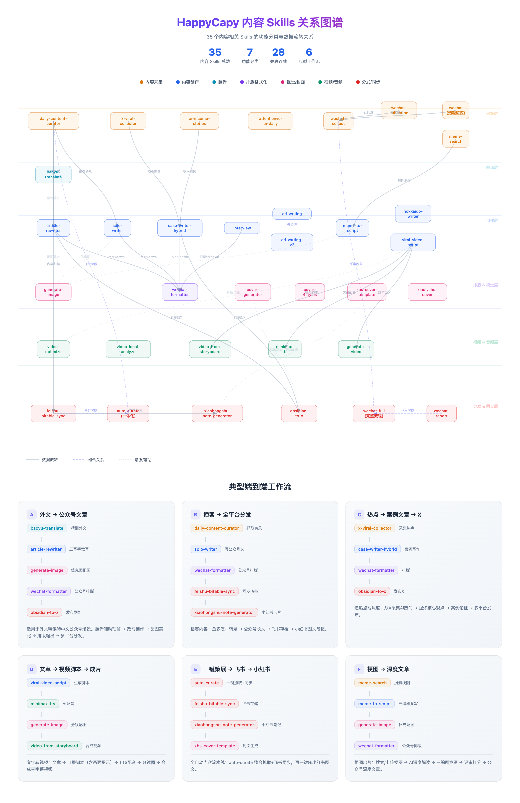
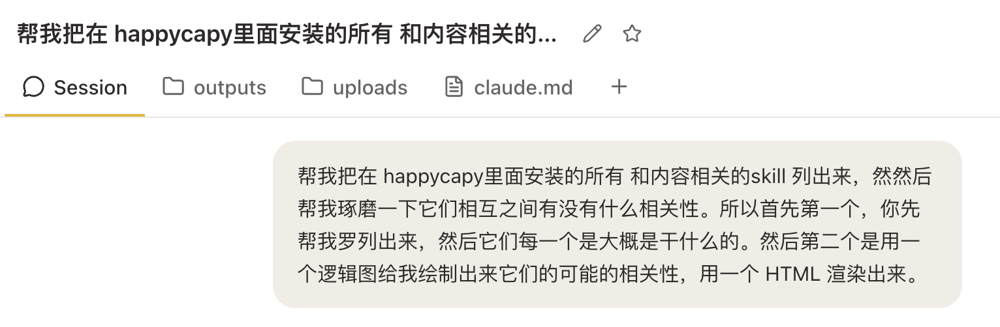
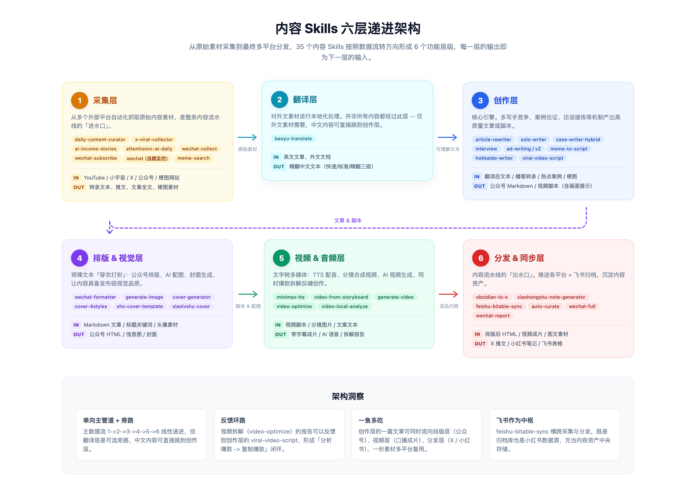
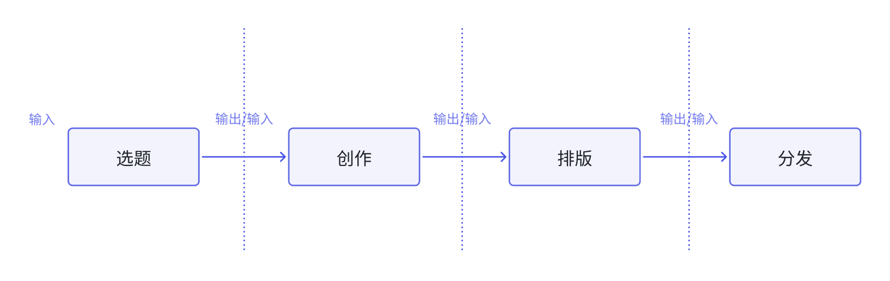
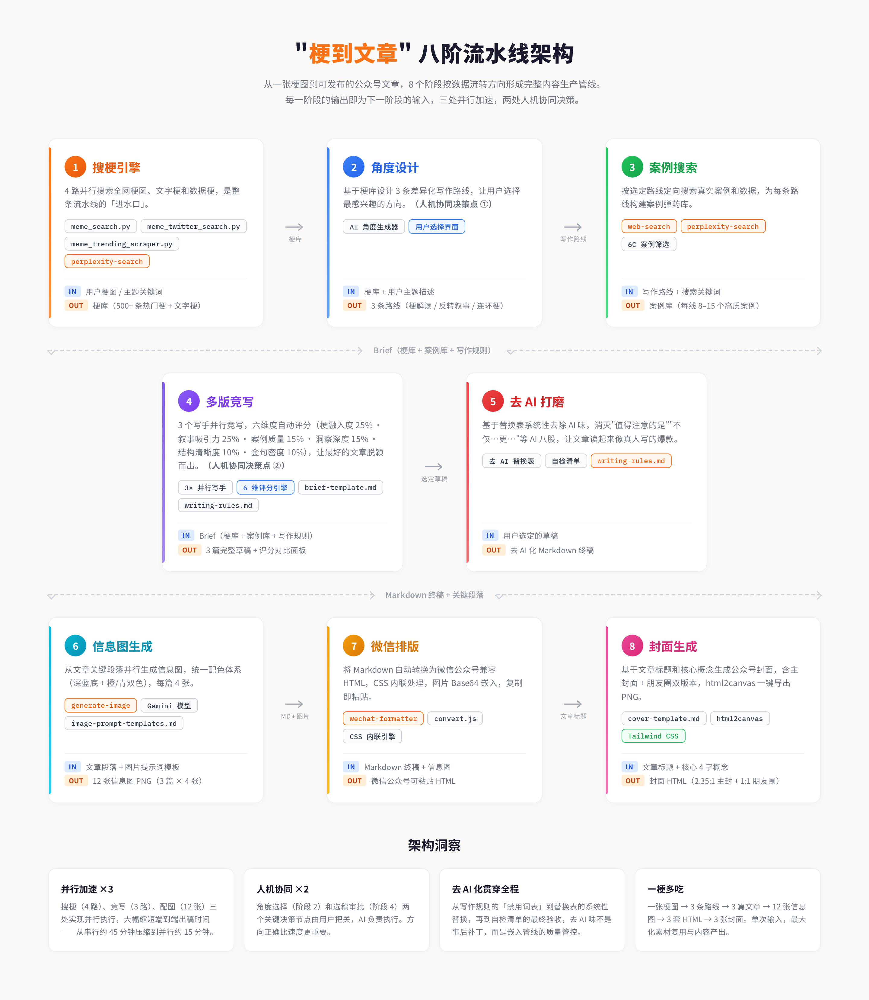
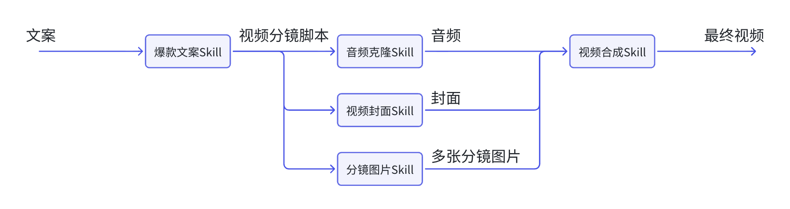
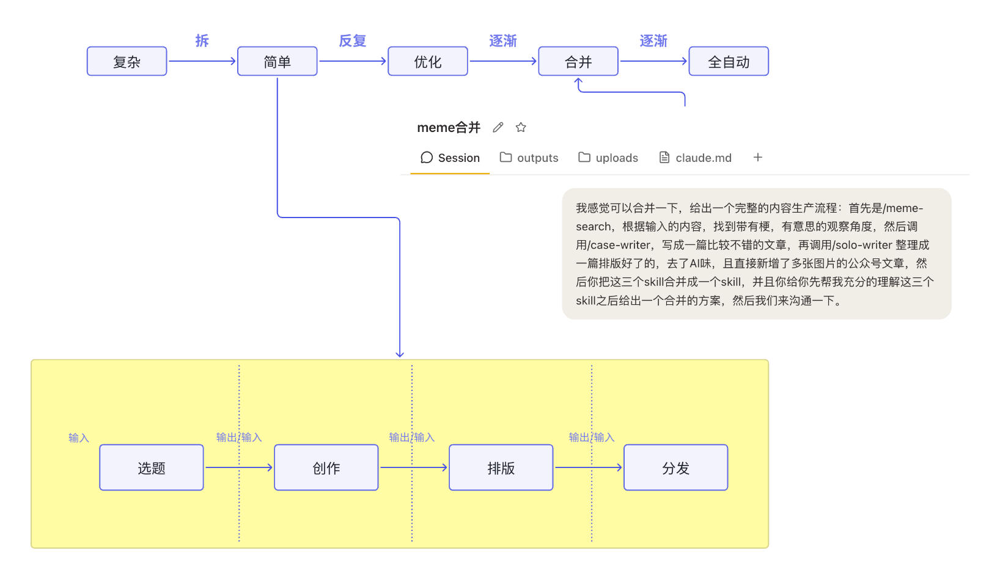
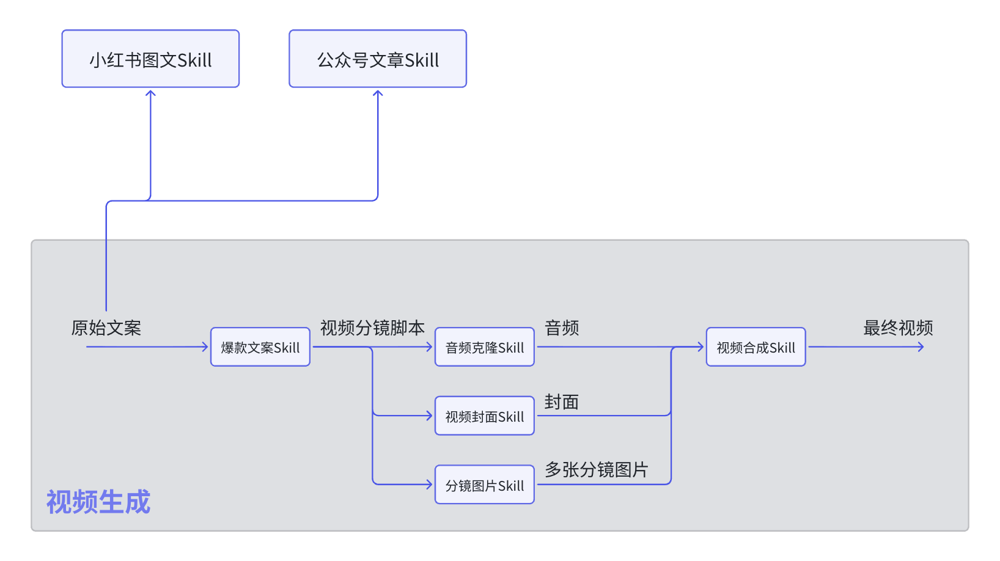

> 🔗 原文链接：[‌‍⁣⁢⁣‍⁣​‌⁡0313 内容Agent第一课](https://forchangesz.feishu.cn/wiki/DfKNw1HliibRvSkXm8ocAguXnKg)

> ⏰ 剪存时间：2026-04-03 17:11:56

> ✂️ 本文档由 [游侠飞书剪存](https://pwwjpto7tva.feishu.cn/wiki/space/7517832277555544092) 一键生成

> 💖 更多好物请访问[游侠创客](https://uibot.cn) 微信：xuefuta

  

> 黄叔的思考分享 [【飞书文档】Openclaw热度会逐渐下降，反而提醒我们要注意工作流的累计](https://forchangesz.feishu.cn/wiki/TNHhwFyDnivsJnkxcw8cu15NnOg?from=from_copylink)
> 
> 直播回放链接：https://fclive.pandacollege.cn/st-live/live?param=XC3pEV

黄叔最近在带着两个社群的成员，我们在线下 打磨 内容相关的Skill，也在和大家学习，发现了一些很有意思的思考。包括整个内容Agent如何搭建，这里和大家交流。

先看一下这张图这是我从春节开始密集使用 Happycapy 创建的内容相关的skill ，然后我让 Happycapy 直接生成了一个关系图谱。

链接：https://happycapy.ai/share/1ebddda0-a24f-496d-940a-e2b1701f449b

仔细看我觉得这里面有一个框架讲得非常的好：

你会发现，做的这35个 skill 被 AI 分成了六大层，实际上这六大层的串联就构成了 一个完整的内容，从采集到最后的分发。

那怎么理解这件事？其实我们想一下，我们生产内容的流程。其实也是。按照这个逻辑来进行的。

非常像一个工作流，每个节点连接起来。

拿我写的文章：https://mp.weixin.qq.com/s/r\_MeVkOVEH9oDGs6\_QjiPw来看，它的整个流程是这样的：

https://happycapy.ai/share/0c93d18b-c1f7-4e40-9a1d-0449a69e94c1

输入非常简单，但最后的效果还不错~那它的处理逻辑是怎么样的呢：

好的，单纯就这个 skill 来讲我觉得它已经挺完整了。但是你会发现一个问题是，这个复杂的逻辑，是一次就能生成的么？

我们再拿一个视频生成的Skill来拆解一下

所以它最开始不是从文案直接生成视频的，是拆分为中间多个产物，这个思路是：

https://happycapy.ai/share/c408f518-b7c9-443b-bc7d-110e564e778e

另外一种思考维度：如何一鱼多吃？

